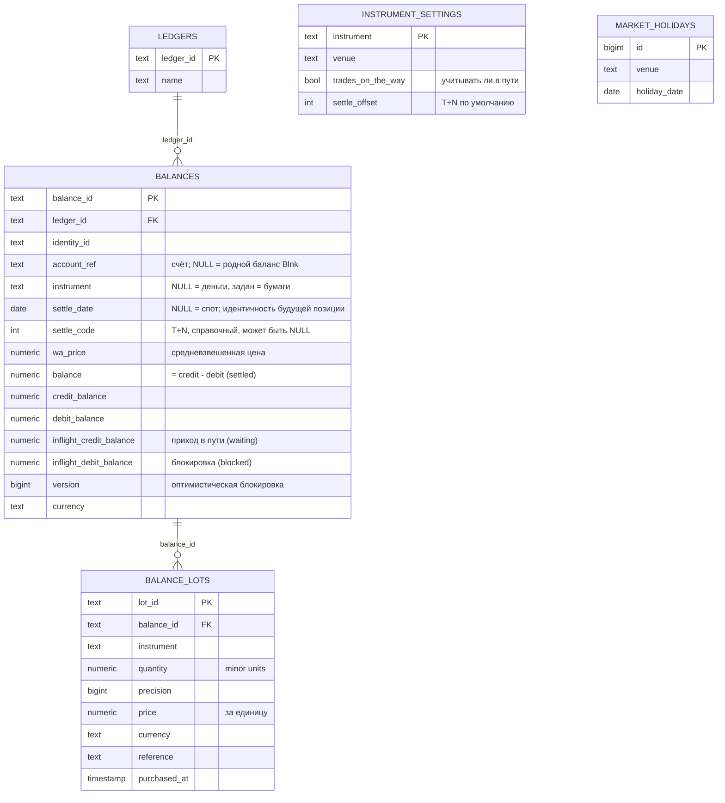
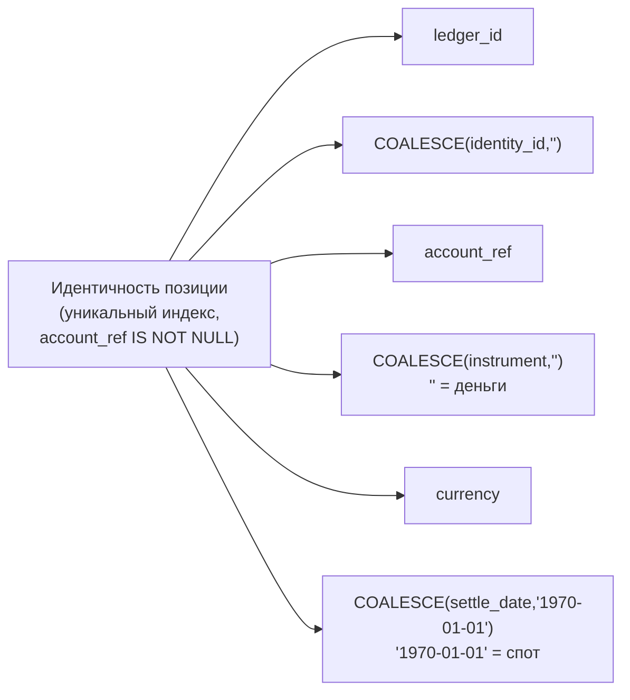
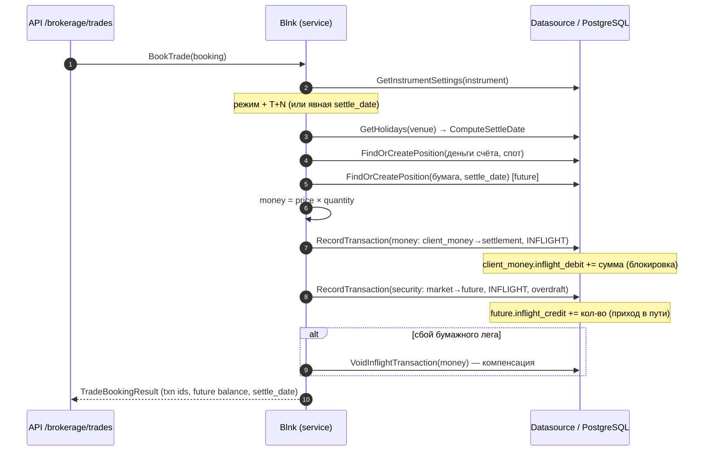
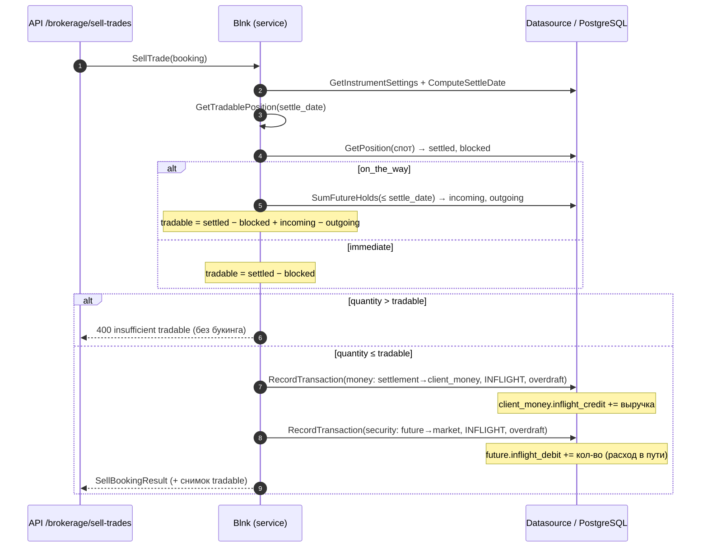
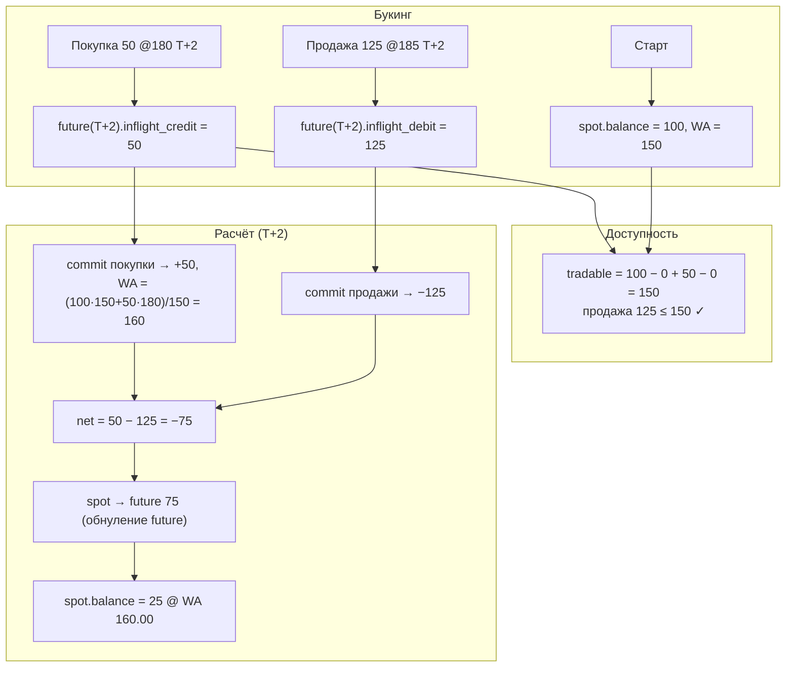
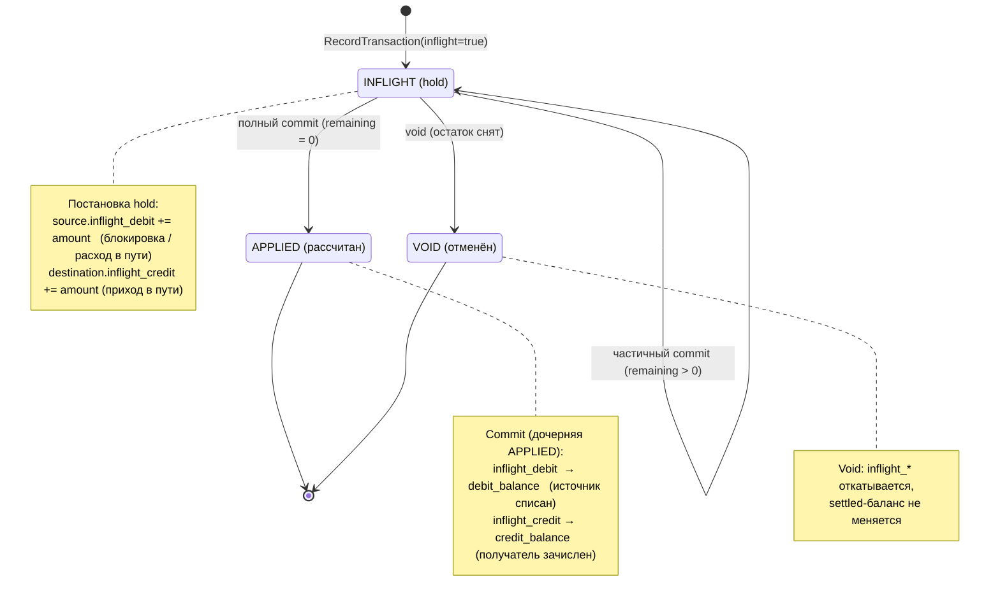
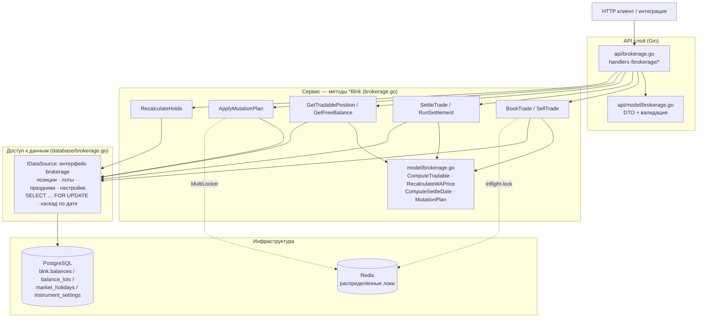

# Брокерский учёт балансов поверх Blnk — техническое описание

Документ описывает, **как устроен и считается** брокерский слой балансов
(порт подсистемы балансов TradeControl на ledger Blnk): какие сервисы, какие
таблицы, какие поля и значения, и по какой логике пересчитываются балансы.

Связанные документы: `docs/brokerage.md` (дизайн и маппинг на TradeControl),
`ОПИСАНИЕ.md` (обзор Blnk).

---

## 1. Идея в двух абзацах

Blnk — это ledger двойной записи: у каждого баланса есть `credit_balance`,
`debit_balance` (и `balance = credit − debit`), а также «зависшие» (inflight)
суммы. Брокерский слой **не вводит новую модель учёта**, а накладывает на эти
примитивы доменную семантику ценных бумаг: позиция по инструменту, дата
расчётов T+N, блокировки/приход «в пути», средневзвешенная цена.

Ключевая идея — **позиция = баланс Blnk**, размеченный дополнительными
колонками. Денежные позиции и позиции по бумагам — это строки в одной таблице
`blnk.balances`; различаются наличием инструмента. «Спот» (рассчитанная
позиция) и «будущие» позиции по датам расчётов — это **отдельные строки**,
которые при наступлении даты расчёта сводятся (нетятся) в спот обычной двойной
записью.

---

## 2. Таблицы и значения

### 2.1. `blnk.balances` (расширение нативной таблицы)

К стандартной таблице балансов добавлены колонки (миграции `1781243214.sql`,
`1781256443.sql`):

| Колонка | Тип | Значение |
|---|---|---|
| `account_ref` | TEXT, nullable | брокерский счёт (группирует позиции одного счёта). `NULL` ⇒ это «родной» баланс Blnk, не управляемый брокерским слоем |
| `instrument` | TEXT, nullable | тикер/ISIN инструмента. **`NULL` ⇒ денежная позиция; задан ⇒ позиция по бумагам** (инвариант TradeControl «ticker == null ⇒ деньги») |
| `settle_date` | DATE, nullable | **дата расчётов**. `NULL` ⇒ спот (рассчитанная позиция); дата ⇒ будущая позиция, созревающая в этот день |
| `settle_code` | INT, nullable | смещение T+N, **справочный** атрибут. Может быть `NULL`, если N не контролируется |
| `wa_price` | NUMERIC(34,2) | средневзвешенная цена покупки по бумаге (только для спота инструмента) |

Используемые нативные поля Blnk (трактовка в брокерском контексте):

| Поле | Брокерский смысл |
|---|---|
| `balance` (= `credit − debit`) | рассчитанный остаток позиции (settled) |
| `credit_balance` / `debit_balance` | приход / расход (двойная запись); из них собирается `balance` |
| `inflight_debit_balance` | **блокировка** (TradeControl `blockedAmount`): незакоммиченный исходящий hold |
| `inflight_credit_balance` | **приход «в пути»** (TradeControl `waitingAmount`): незакоммиченный входящий hold |
| `inflight_balance` (= `inflight_credit − inflight_debit`) | чистый inflight |
| `version` | оптимистическая блокировка (увеличивается при каждом апдейте) |

**Уникальный индекс ключа позиции** (`idx_balances_position_key`, частичный —
только при `account_ref IS NOT NULL`):

```
(ledger_id, COALESCE(identity_id,''), account_ref,
 COALESCE(instrument,''), currency, COALESCE(settle_date,'1970-01-01'))
```

То есть **идентичность позиции** — это шесть измерений, где дата расчётов
участвует как абсолютная дата (спот → с'1970-01-01'). Дубль активной позиции
невозможен на уровне БД.

### 2.2. `blnk.balance_lots` — лоты покупок (аналог `BalanceDetail`)

История покупок по бумаге, нужна для пересчёта WA-цены и комплаенса.

| Колонка | Значение |
|---|---|
| `lot_id` | UUID лота (`lot_…`) |
| `balance_id` | спот-баланс бумаги, к которому относится лот |
| `instrument` | инструмент |
| `quantity` | количество в minor units (precise) |
| `precision` | множитель точности количества (units → minor units) |
| `price` | цена покупки за единицу (NUMERIC 34,8) |
| `currency`, `reference`, `purchased_at`, `created_at` | валюта, ссылка на сделку, время |

### 2.3. `blnk.market_holidays` — праздники площадок (аналог `HolidayService`)

| Колонка | Значение |
|---|---|
| `venue` | торговая площадка (например, `NASDAQ`, `KASE`) |
| `holiday_date` | нерабочий (нерасчётный) день |
| уникальность | `(venue, holiday_date)` |

Используется при вычислении даты расчётов T+N: выходные и праздники площадки
не считаются расчётными днями.

### 2.4. `blnk.instrument_settings` — режим инструмента

Определяет, торгуется ли инструмент «в пути» (settle на T+N) и с каким
смещением.

| Колонка | Значение |
|---|---|
| `instrument` | уникальный ключ |
| `venue` | площадка (для календаря праздников) |
| `trades_on_the_way` | BOOL — учитывать ли будущие приход/расход в «доступно к продаже» |
| `settle_offset` | T+N по умолчанию для этого инструмента |

**Правило:** нет записи или `trades_on_the_way = false` ⇒ инструмент
immediate-settlement: будущие приход/расход **не** учитываются как доступные.

### 2.5. `blnk.brokerage_settlement_journal` — журнал расчёта

Идемпотентность и восстановление побочных эффектов расчёта (см. §5.4).
Ключ — `security_txn_id`. Поля `wa_before`, `qty_before`, `price`, `quantity`,
`precision` захватывают вход для детерминированного пересчёта `wa_after`;
`status` ∈ {`pending`, `applied`}; `lot_id` — созданный лот.

> **Входные значения брокерского API — строки/целые, не float.** `quantity`
> передаётся точной decimal-строкой, `*_precision` — целыми; перевод в minor
> units идёт через `model.PreciseQuantity`/`PreciseMoney` → `big.Int`.

---

## 3. Слои и сервисы (где какой код)

| Слой | Файлы | Ответственность |
|---|---|---|
| **Модель** | `model/brokerage.go` | чистая логика без БД: `PositionKey`, `BalanceDelta`/`MutationPlan`, `ComputeSettleDate`, `RecalculateWAPrice`, `ComputeTradable`, `FreeBalance`, структуры сделок |
| **Доступ к данным** | `database/brokerage.go` (+ интерфейс `brokerage` в `repository.go`) | CRUD позиций по ключу-дате, каскад, атомарные мутации под `FOR UPDATE`, лоты, праздники, настройки инструмента, агрегаты «в пути» |
| **Сервис (бизнес-логика)** | `brokerage.go` (методы `*Blnk`) | букинг/расчёт сделок, доступность к продаже, FreeBalance, мутационный план под распределённой блокировкой, пересчёт холдов |
| **HTTP API** | `api/brokerage.go`, DTO `api/model/brokerage.go`, маршруты `api/api.go` | REST-поверхность `/brokerage/*` |
| **Схема** | `sql/1781243214.sql`, `sql/1781246704.sql`, `sql/1781256443.sql` | миграции |

### Ключевые методы сервиса (`*Blnk`)

- `SetInstrumentSettings` / `GetInstrumentSettings` — режим инструмента.
- `AddMarketHoliday` / `GetMarketHolidays` / `ComputeSettleDate` — календарь и T+N.
- `GetOrCreatePosition` / `GetActivePosition` — доступ к позициям.
- `GetTradablePosition` — **сколько можно продать** (settle-aware).
- `BookTrade` (покупка) / `SellTrade` (продажа) — букинг.
- `SettleTrade` / `RunSettlement` — расчёты (settlement).
- `ReconcileSettlement` — восстановление незавершённых побочных эффектов расчёта.
- `ApplyMutationPlan` — атомарная корректировка набора позиций.
- `RecalculateHolds` — пересборка блокировок/прихода из транзакций.
- `GetFreeBalance` — свободный остаток по денежному балансу.
- `GetBalanceLots` — лоты позиции.

---

## 4. Логика расчёта балансов

### 4.1. Дата расчётов T+N (`ComputeSettleDate`)

`ComputeSettleDate(venue, tradeDate, N)`:
1. загружается календарь праздников площадки (`market_holidays`);
2. от `tradeDate` отсчитывается **N расчётных дней**, пропуская субботы,
   воскресенья и праздники площадки;
3. даже при N=0 возвращается ближайший расчётный день (T+0 не может попасть
   на праздник/выходной).

Если N не контролируется — дата задаётся напрямую (см. 4.6), календарь не
используется.

### 4.2. Доступно к продаже (`ComputeTradable` / `GetTradablePosition`)

Сердце требования. Формула зависит от признака инструмента:

```
on-the-way:  tradable = settled − blocked + incoming(≤ дата расчёта) − outgoing(≤ дата расчёта)
immediate:   tradable = settled − blocked
                       (будущие приход/расход НЕ учитываются)
отрицательный результат отсекается до 0.
```

Где:
- `settled` = `balance` спот-позиции бумаги;
- `blocked` = `inflight_debit_balance` спота (уже зарезервированные продажи);
- `incoming` / `outgoing` = суммы `inflight_credit_balance` /
  `inflight_debit_balance` по **будущим** позициям (`settle_date IS NOT NULL`),
  созревающим не позже даты расчёта проверяемой сделки (`SumFutureHolds`).

Флаг `on_the_way` берётся из `instrument_settings`. Если настроек нет — `false`.

### 4.3. Свободный денежный остаток (`FreeBalance` / `GetFreeBalance`)

Пороговая модель TradeControl `Sum0/Sum1/Sum2`:

```
d = Sum1 − Sum2          # доступно минус обязательства
d < 0                 -> 0
Sum0 задан и d ≥ Sum0 -> Sum0   (опциональный потолок)
иначе                 -> d
```

По умолчанию `Sum1 = balance − inflight_debit` (блокировки),
`Sum2 = queued_debit` (очередь обязательств), `Sum0` — необязательный cap.

### 4.4. Средневзвешенная цена (`RecalculateWAPrice`)

При расчёте **покупки** (на settlement, не на букинге):

```
WA_new = (tradeMoney + WA_old × qty_old) / (qty_trade + qty_old)
```

- арифметика на `decimal` (без float), округление **HALF_EVEN**, scale 2;
- `qty_old` — спот-количество (+ уже рассчитанные в этом проходе покупки);
- продажа по WA **не меняет** WA остатка (среднее на единицу неизменно);
- одновременно создаётся лот в `balance_lots`.

### 4.5. Атомарные мутации (`MutationPlan` / `ApplyMutationPlan` / `ApplyBalanceDeltas`)

Канал «ручных» корректировок набора позиций (реконсиляция и т.п.):

- `BalanceDelta{ key, amountDelta, blockedDelta, waitingDelta }`;
- план **нормализуется**: дельты по одному ключу сливаются, no-op отбрасываются,
  ключи сортируются по `LockKey()` (детерминированный порядок — защита от
  deadlock);
- `ApplyMutationPlan` берёт **распределённые Redis-локи** по всем ключам в
  отсортированном порядке (`MultiLocker.WaitLock`), затем `ApplyBalanceDeltas`
  в одной транзакции БД:
  1. `SELECT … FOR UPDATE` по каждому ключу (создание отсутствующих позиций);
  2. применение дельт с сохранением инвариантов:
     `amountDelta>0 → credit`, `<0 → debit`; `blockedDelta → inflight_debit`;
     `waitingDelta → inflight_credit`; уход холдов в минус **отклоняется**;
  3. `balance = credit − debit`, `inflight = inflight_credit − inflight_debit`,
     `version += 1`;
  4. локи снимаются после коммита/отката.

Штатные движения денег/бумаг идут **не** через мутации, а через транзакции
Blnk (см. ниже).

### 4.6. Пересчёт блокировок/прихода из истории (`RecalculateHolds`)

Аналог `recalculateBlockedWaitingAmount*`: пересобирает `inflight_debit` /
`inflight_credit` баланса из **живых INFLIGHT-транзакций** (с учётом частичных
коммитов и VOID), параллельно (semaphore=10), ошибки агрегируются по балансам.

---

## 5. Жизненный цикл сделки (что происходит с полями)

### 5.1. Покупка — `BookTrade`

1. Резолвится режим инструмента (`resolveTradeParams`) и **дата расчётов**
   (`resolveSettlement`): либо T+N через календарь, либо явная `settle_date`
   (тогда `settle_code = NULL`).
2. Денежная позиция счёта (`account_ref`, без инструмента) — `GetOrCreatePosition`.
3. Будущая позиция бумаги на `settle_date` — `GetOrCreatePosition` (создаётся на лету).
4. **Денежный лег** (INFLIGHT): `client_money → settlement`
   → у клиента `inflight_debit += сумма` (**блокировка денег**).
5. **Бумажный лег** (INFLIGHT, `AllowOverdraft`): `market → future_position`
   → у будущей позиции `inflight_credit += кол-во` (**приход в пути**).
6. Леги связаны метаданными (`trade_ref`, `trade_side=buy`, `money_leg_id`, цена, дата).
   При сбое бумажного лега денежный компенсируется `VoidInflightTransaction`.

Итог: спот не тронут; на будущей позиции висит `inflight_credit`.

### 5.2. Продажа — `SellTrade`

1. Дата расчётов резолвится так же (T+N или явная).
2. **Проверка доступности**: `GetTradablePosition(дата расчёта)`. Если
   `quantity > tradable` → отказ `ErrBadRequest` (до любого букинга).
3. **Денежный лег** (INFLIGHT, `AllowOverdraft` на settlement):
   `settlement → client_money` → `inflight_credit` денег (приход выручки).
4. **Бумажный лег** (INFLIGHT, `AllowOverdraft`): `future_position → market`
   → у будущей позиции `inflight_debit += кол-во` (**расход в пути**).
   Overdraft безопасен: доступность уже проверена с учётом прихода в пути.

Итог: на будущей позиции одного дня могут одновременно копиться
`inflight_credit` (покупки) и `inflight_debit` (продажи).

### 5.3. Расчёт — `SettleTrade` / `RunSettlement` (`settleFutureBalance`)

`RunSettlement(asOf)` находит будущие позиции с `settle_date ≤ asOf`
(`GetMaturedPositions`) и для каждой вызывает `settleFutureBalance`:

1. берутся все незакрытые INFLIGHT-леги позиции (`GetPendingInflightByBalance`),
   разделяются на покупки и продажи; **покупки обрабатываются первыми**;
2. для каждого лега коммитятся денежный и бумажный hold
   (`CommitInflightTransaction`): inflight → settled (на источнике растёт
   `debit`, на получателе `credit`);
3. для покупок — пересчёт WA-цены и создание лота (WA считается по
   спот-количеству до ролла + накопленные покупки этого прохода);
4. **знаковый net-roll**: после коммитов на будущей позиции
   `balance = credit − debit` = чистая дельта дня:
   - `> 0` (нетто-приход): транзакция `future → spot` на эту величину;
   - `< 0` (нетто-расход): транзакция `spot → future` на модуль (`AllowOverdraft`);
   - будущая позиция обнуляется, спот сдвигается на чистую дельту.

`SettleTrade(securityTxnID)` — то же для одного bucket'а (по легу сделки):
рассчитывает весь bucket этой даты.

Ошибки агрегируются по позициям/сделкам — один сбой не блокирует проход.

### 5.4. Надёжность расчёта (двухфазный журнал + recovery)

Побочные эффекты расчёта покупки (`wa_price` + лот) применяются **атомарно и
восстановимо** через `brokerage_settlement_journal`:

1. до коммита легов пишется `pending`-строка с `wa_before`/`qty_before`
   (этого достаточно, чтобы `wa_after` пересчитывался детерминированно);
2. лот + `wa_price` + флаг `applied` — в одной транзакции БД;
3. при сбое между коммитом и шагом 2 остаётся `pending`-строка, которую
   `ReconcileSettlement` (вызывается в начале `RunSettlement`) доводит до конца.

Лоты идемпотентны по `(balance_id, reference)`; `GetMaturedPositions`
пропускает обнулённые bucket'ы, поэтому повторный `RunSettlement` идемпотентен.

### 5.5. Наблюдаемость (метрики)

`internal/metrics/brokerage.go` экспортирует OTel-инструменты:
`blnk.brokerage.trade.booked.total` (side, instrument),
`blnk.brokerage.sell.rejected.total` (reason),
`blnk.brokerage.settlement.run.total`, `…errors.total`, `…settled.trades.total`,
`…matured_buckets` (гистограмма), `…settlement.duration` (гистограмма),
`…settlement.reconciled.total`.

---

## 6. Мультидневный учёт и неконтролируемый N

- Идентичность будущей позиции — **абсолютная `settle_date`**, не смещение.
  Сделки одного инструмента/счёта с одним и тем же T+N в **разные торговые
  дни** образуют **разные** позиции и рассчитываются независимо.
- `settle_code` — только справочный атрибут; может быть `NULL`.
- Если N не контролируется — в `BookTrade`/`SellTrade` (и DTO) передаётся
  `settle_date` напрямую; календарь и offset игнорируются.
- Каскад `GetActivePosition(date)` берёт последнюю позицию с
  `settle_date ≤ date`, иначе спот (`settle_date IS NULL`).

---

## 7. Конкурентность и целостность

- **Распределённые локи** (Redis, `internal/lock`): inflight-commit по
  транзакции; мутационный план — `MultiLocker` по отсортированным ключам.
- **Оптимистическая блокировка**: `version` на балансах (нативный механизм Blnk).
- **`SELECT … FOR UPDATE`** в `ApplyBalanceDeltas` и `RecomputeHolds`.
- **Уникальный индекс** ключа позиции — единственность активной записи на
  уровне БД.
- **Hash-chain** Blnk обеспечиваеттампер-эвиденс журнала транзакций.

---

## 8. REST API (`/brokerage/*`)

| Метод | Путь | Назначение |
|---|---|---|
| POST | `/brokerage/instruments` | задать режим инструмента (`trades_on_the_way`, `settle_offset`) |
| GET | `/brokerage/instruments/:instrument` | режим инструмента |
| POST | `/brokerage/holidays` | добавить праздник площадки |
| GET | `/brokerage/holidays/:venue` | праздники площадки |
| POST | `/brokerage/settle-date` | вычислить дату расчётов T+N |
| POST | `/brokerage/positions` | создать/получить позицию по ключу |
| GET | `/brokerage/positions/active` | активная позиция (каскад по `max_settle_date`) |
| GET | `/brokerage/positions/tradable` | доступно к продаже (settle-aware) |
| POST | `/brokerage/trades` | букинг покупки |
| POST | `/brokerage/sell-trades` | букинг продажи |
| POST | `/brokerage/trades/:txID/settle` | расчёт bucket'а по легу сделки |
| POST | `/brokerage/settlements/run` | расчёт всех созревших позиций |
| POST | `/brokerage/mutations` | применить мутационный план |
| POST | `/brokerage/balances/recalculate-holds` | пересборка блокировок/прихода |
| GET | `/brokerage/balances/:id/free` | свободный остаток (Sum0/Sum1/Sum2) |
| GET | `/brokerage/balances/:id/lots` | лоты позиции |

---

## 9. Сквозной пример (с числами)

Исходно: 100 AAPL (спот, settled), AAPL = on-the-way T+2.

| Шаг | Действие | Состояние |
|---|---|---|
| 0 | — | spot: balance=100, WA=150.00 |
| 1 | Купить 50 @ 180, T+2 | spot=100; future(T+2): `inflight_credit`=50 |
| 2 | Доступно к продаже на T+2 | `100 − 0 + 50 − 0 = 150` |
| 3 | Продать 125 @ 185, T+2 | разрешено (125 ≤ 150); future(T+2): `inflight_credit`=50, `inflight_debit`=125 |
| 4 | Ещё продать 26 | **отказ**: осталось `150 − 125 = 25` |
| 5 | `RunSettlement` на T+2 | коммит покупки (+50, WA: (100·150 + 50·180)/150 = **160.00**), коммит продажи (−125); net = 50−125 = −75; ролл `spot → future` 75 |
| Итог | — | **spot = 100 + 50 − 125 = 25 AAPL @ WA 160.00** |

Проверено сквозными тестами на реальном PostgreSQL
(`TestBrokerageChain_BuyT2ThenSellExceedingSettled`,
`TestBrokerageChain_MultiDaySeparateBuckets`).

---

## 10. Границы (что НЕ входит)

- AF471 и иная регуляторная отчётность — внешняя интеграция, вне ledger-ядра.
- Маршрутизация EGAR/НТО/BCC и оркестрация (Camunda) — это слой TradeControl.
- Потребление лотов FIFO/LIFO при продаже — не моделируется; авторитетной
  средней служит `wa_price` на балансе (продажа её не меняет).

---

## 11. Диаграммы

### 11.1. Схема данных (ER)



> `INSTRUMENT_SETTINGS` и `MARKET_HOLIDAYS` связаны с позициями логически
> (через `instrument` и `venue`), без внешних ключей: это справочники режима
> и календаря, читаемые сервисом при букинге/расчёте.

### 11.2. Уникальный ключ позиции



### 11.3. Покупка — `BookTrade`



### 11.4. Продажа — `SellTrade` (с проверкой доступности)



### 11.5. Расчёт — `RunSettlement` / `settleFutureBalance` (net-roll)

```mermaid
sequenceDiagram
    autonumber
    participant API as API /brokerage/settlements/run
    participant S as Blnk (service)
    participant DB as Datasource / PostgreSQL

    API->>S: RunSettlement(asOf)
    S->>DB: GetMaturedPositions(settle_date ≤ asOf)
    loop по каждой созревшей позиции
        S->>DB: GetPendingInflightByBalance(future)
        Note over S: разделить леги: покупки, затем продажи
        loop покупки → продажи
            S->>DB: CommitInflightTransaction(money leg)
            S->>DB: CommitInflightTransaction(security leg)
            opt покупка
                S->>S: RecalculateWAPrice (HALF_EVEN, scale 2)
                S->>DB: UpdateWAPrice + CreateLot
            end
        end
        Note over S: net = future.balance (= credit − debit)
        alt net > 0 (нетто-приход)
            S->>DB: RecordTransaction(future→spot, net)
        else net < 0 (нетто-расход)
            S->>DB: RecordTransaction(spot→future, |net|, overdraft)
        end
        Note over DB: future → 0; spot сдвигается на net
    end
    S-->>API: SettlementRunResult (settled / errors по позициям)
```

### 11.6. Поток величин по балансам (от букинга к расчёту)



### 11.7. Жизненный цикл лега сделки (статусы транзакции)

Каждый лег сделки — это inflight-транзакция Blnk. При букинге она ставит hold,
при расчёте коммитится (полностью или частями), при отмене — войдится.



### 11.8. Компонентная схема (слои и зависимости)



> Зависимости направлены сверху вниз: API ничего не знает о БД, сервис
> оперирует доменной моделью и интерфейсом `IDataSource`, а конкретный
> `Datasource` инкапсулирует SQL. Redis используется только для блокировок,
> PostgreSQL — единственный источник истины по балансам.

